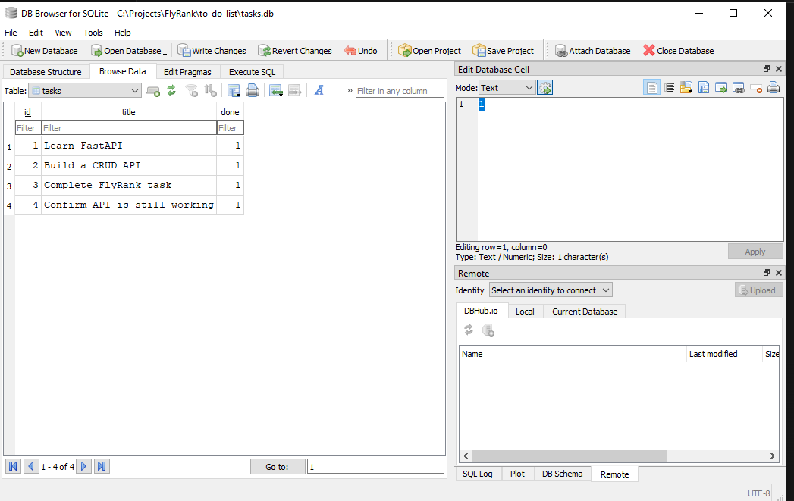

# To-Do List API

This project is a small FastAPI CRUD service for managing to-do tasks. It uses SQLite for persistent local storage and provides endpoints for listing, creating, updating, and deleting tasks.

## Why SQLite?

SQLite was chosen because it is lightweight, requires no separate database server, and stores the complete database in a single portable file. It is a good fit for this small local API while still providing SQL queries, transactions, and persistent data between server restarts.

## Database Location

The database is stored in the project root as `tasks.db`. The application creates the database and `tasks` table automatically when it starts if they do not already exist.

## Install and Run

Install the dependencies and start the development server with:

```bash
pip install -r requirements.txt
uvicorn main:app --reload
```

The API will be available at `http://127.0.0.1:8000`. Interactive Swagger documentation is available at `http://127.0.0.1:8000/docs`.

## API Endpoints

| Method | Endpoint | Description | Success Status |
| --- | --- | --- | --- |
| `GET` | `/` | Returns API metadata and the main endpoint list. | `200` |
| `GET` | `/health` | Returns the API health status. | `200` |
| `GET` | `/tasks` | Returns all tasks. | `200` |
| `GET` | `/tasks/{id}` | Returns a task by numeric ID. | `200` |
| `POST` | `/tasks` | Creates a task with a non-empty `title`. | `201` |
| `PUT` | `/tasks/{id}` | Updates a task's `title`, `done` value, or both. | `200` |
| `DELETE` | `/tasks/{id}` | Deletes a task by numeric ID. | `204` |

## Database Viewer

The SQLite database was opened in DB Browser for SQLite:



## Example SQL Query

The following query was executed against `tasks.db` to list completed tasks:

```sql
SELECT id, title, done
FROM tasks
WHERE done = 1;
```
